Diagramma drawSql
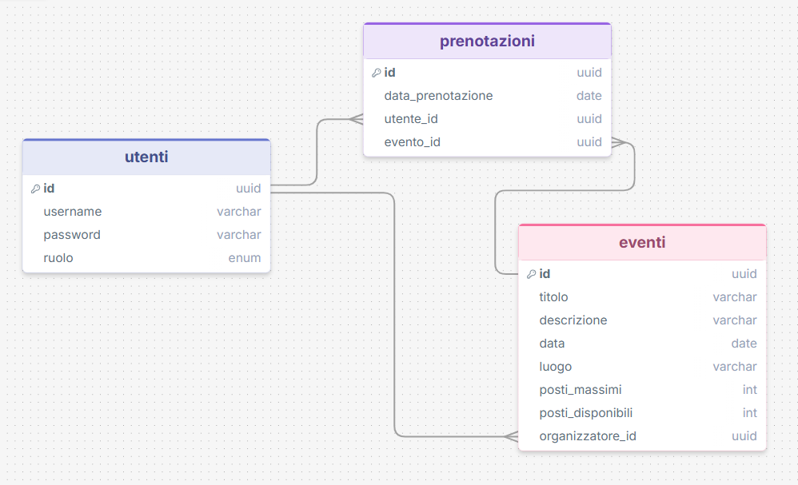

Diagramma postgreSQL
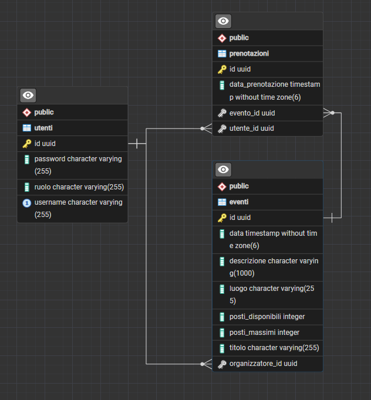

Aggiunta di un organizzatore
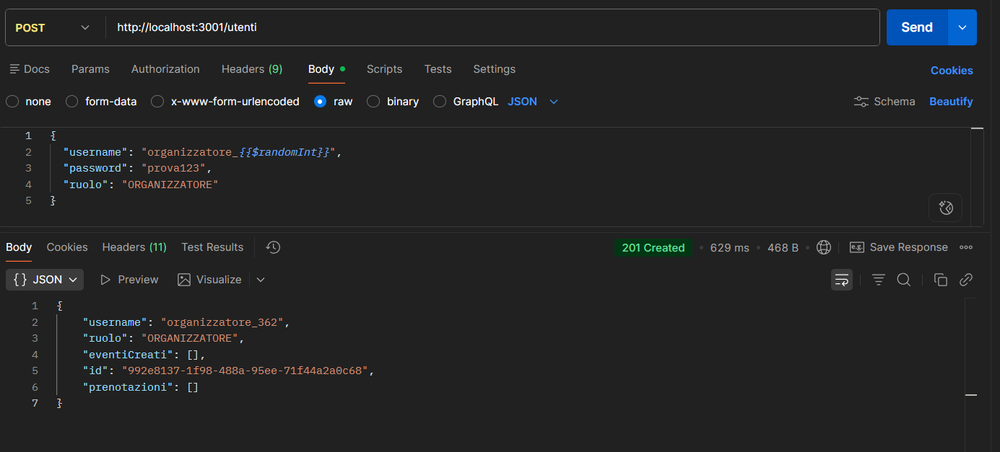

Login organizzatore
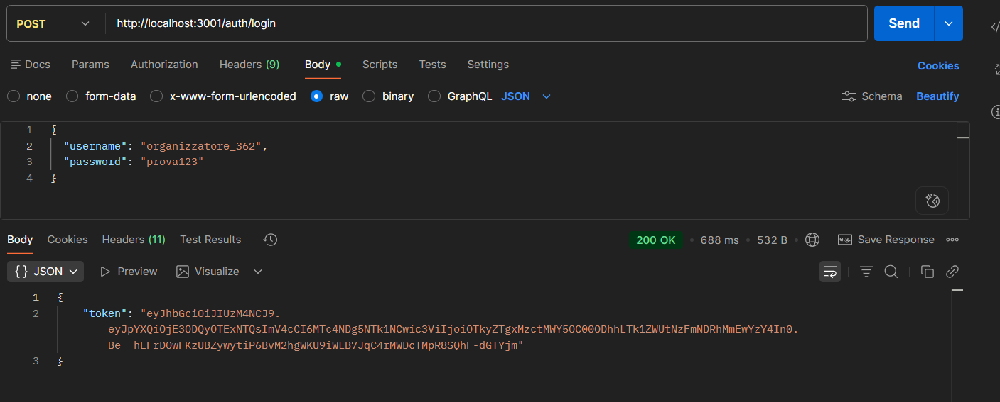

Aggiunta utente normale
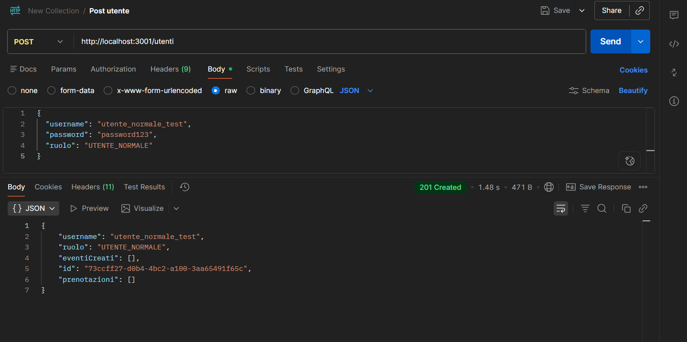

Login utente normale
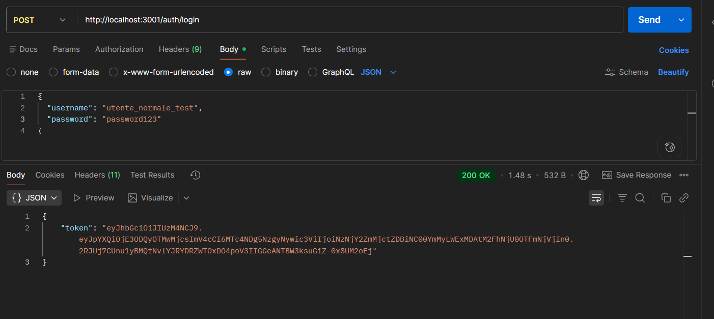

Aggiunta Evento
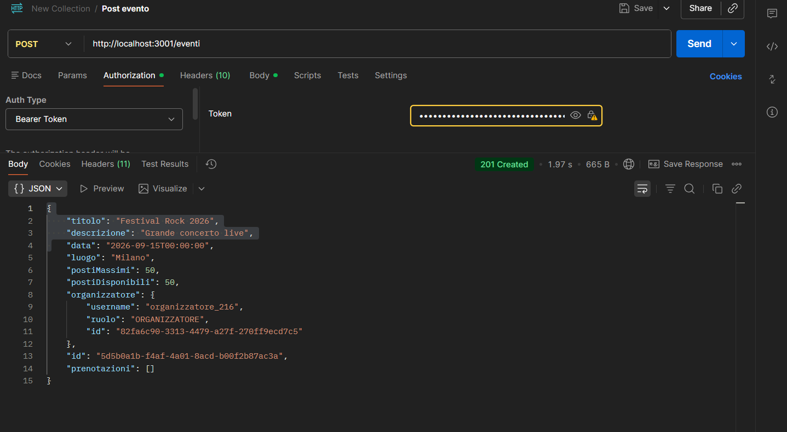

Un utente normale non puo creare un evento
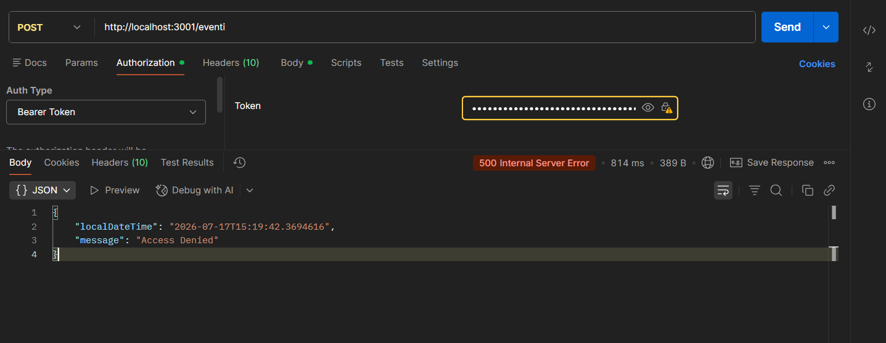

Aggiornamento evento
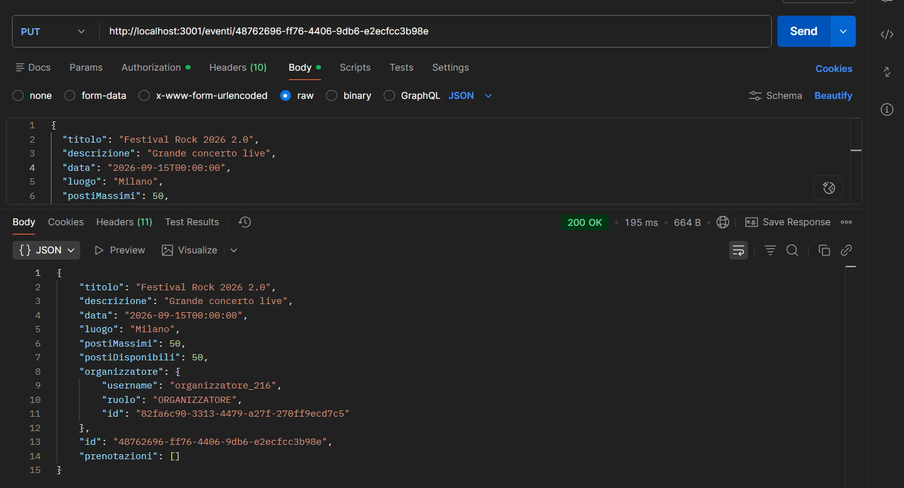

Organizzatore non ha i diritti di aggiornare un evento
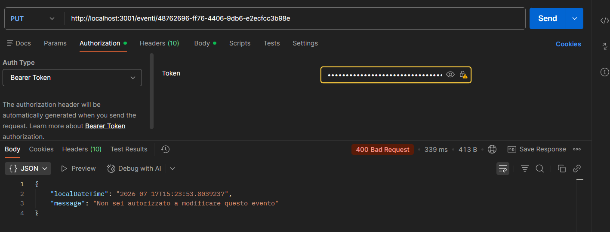

Get eventi
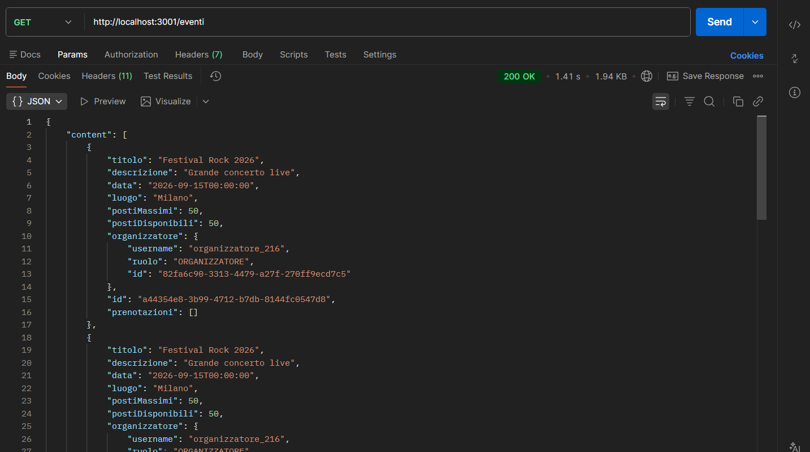

Prenotazione di un utente
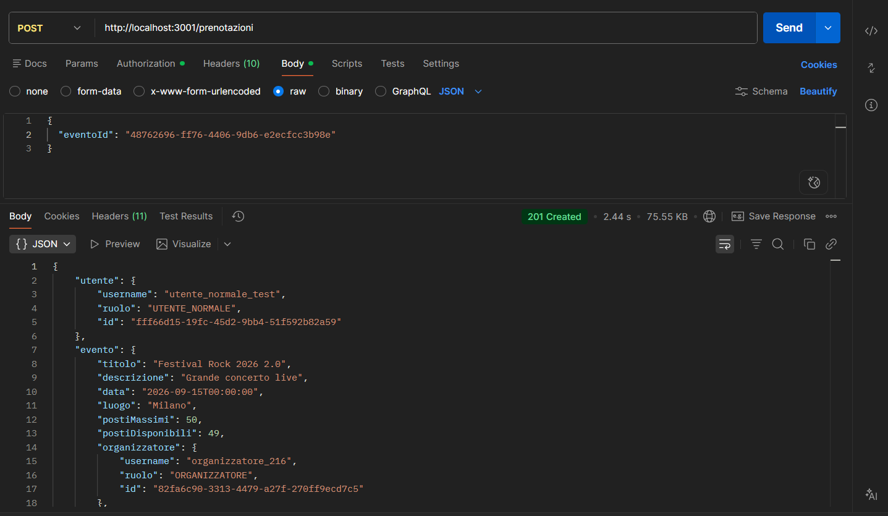

Lista mie prenotazioni
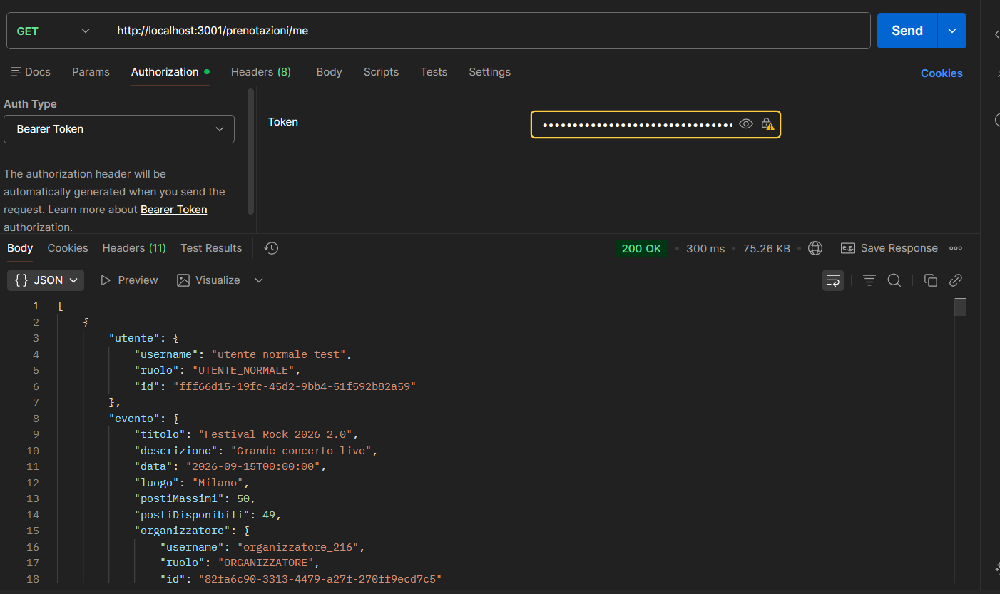

Delete evento
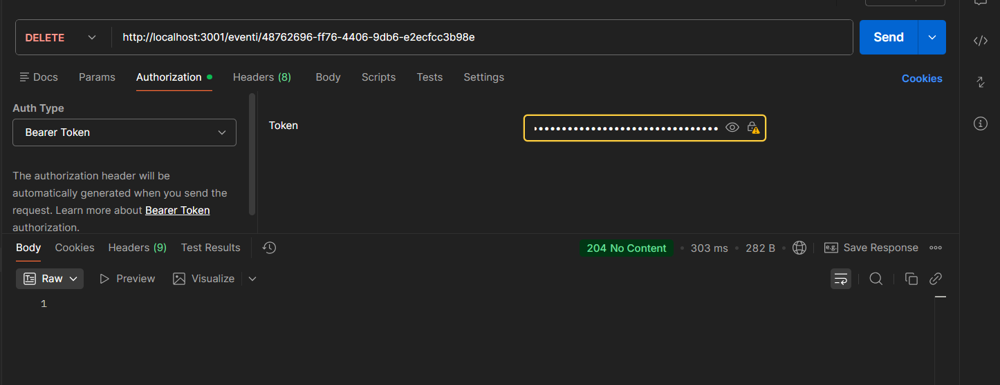